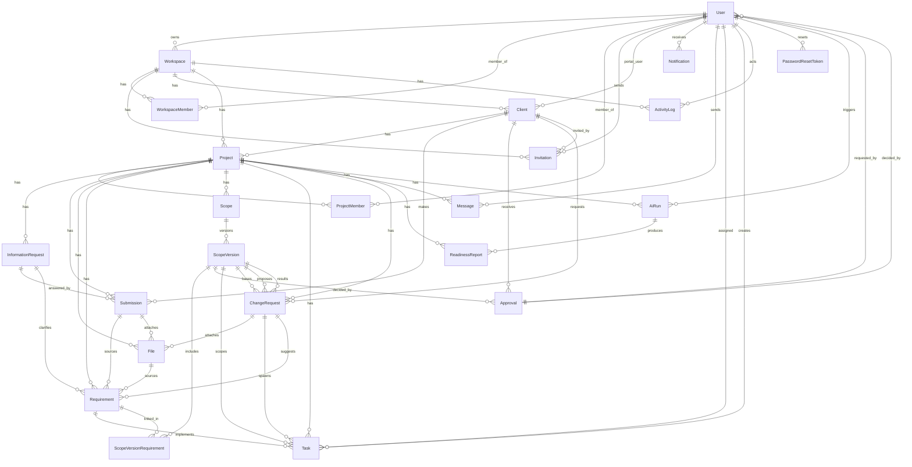

# 07 — ERD (matches `backend/prisma/schema.prisma`)

```mermaid
erDiagram
    User ||--o{ Workspace : owns
    User ||--o{ WorkspaceMember : member_of
    User ||--o{ ProjectMember : member_of
    User ||--o{ Invitation : sends
    User ||--o{ Client : portal_user
    Workspace ||--o{ WorkspaceMember : has
    Workspace ||--o{ Invitation : has
    Workspace ||--o{ Client : has
    Workspace ||--o{ Project : has
    Workspace ||--o{ ActivityLog : has
    Client ||--o{ Project : has
    Client ||--o{ Submission : makes
    Client ||--o{ Approval : receives
    Client ||--o{ ChangeRequest : requests
    Client ||--o{ Invitation : invited_by
    Project ||--o{ ProjectMember : has
    Project ||--o{ InformationRequest : has
    Project ||--o{ Submission : has
    Project ||--o{ File : has
    Project ||--o{ Requirement : has
    Project ||--o{ Scope : has
    Project ||--o{ Task : has
    Project ||--o{ ChangeRequest : has
    Project ||--o{ Message : has
    Project ||--o{ ReadinessReport : has
    Project ||--o{ AiRun : has
    InformationRequest ||--o{ Submission : answered_by
    InformationRequest ||--o{ Requirement : clarifies
    Submission ||--o{ Requirement : sources
    Submission ||--o{ File : attaches
    File ||--o{ Requirement : sources
    Requirement ||--o{ Task : implements
    Requirement ||--o{ ScopeVersionRequirement : linked_in
    Scope ||--o{ ScopeVersion : versions
    ScopeVersion ||--o{ ScopeVersionRequirement : includes
    ScopeVersion ||--o{ Approval : decided_by
    ScopeVersion ||--o{ Task : scopes
    ScopeVersion ||--o{ ChangeRequest : bases
    ScopeVersion ||--o{ ChangeRequest : proposes
    ScopeVersion ||--o{ ChangeRequest : results
    Approval ||--o{ User : requested_by
    Approval ||--o{ User : decided_by
    ChangeRequest ||--o{ File : attaches
    ChangeRequest ||--o{ Task : spawns
    ChangeRequest ||--o{ Requirement : suggests
    AiRun ||--o{ ReadinessReport : produces
    User ||--o{ Notification : receives
    User ||--o{ Message : sends
    User ||--o{ Task : assigned
    User ||--o{ Task : creates
    User ||--o{ ActivityLog : acts
    User ||--o{ PasswordResetToken : resets
    User ||--o{ AiRun : triggers
```
