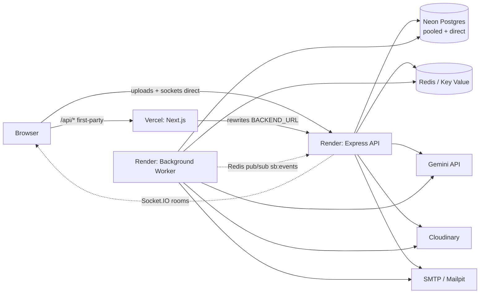

# 09 — System architecture

- Request flow (heavy work): request → API → queue → Redis → worker → Gemini/email/processing → Postgres → event bus → API → browser.
- Stateless API (JWT + Redis sessions); worker scales horizontally; sockets authorized per project (team/client rooms).
- Local: Next `next dev` (:3000) + API (:4000) + worker + brew/docker Postgres/Redis/Mailpit.
