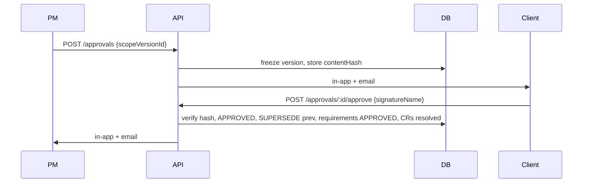
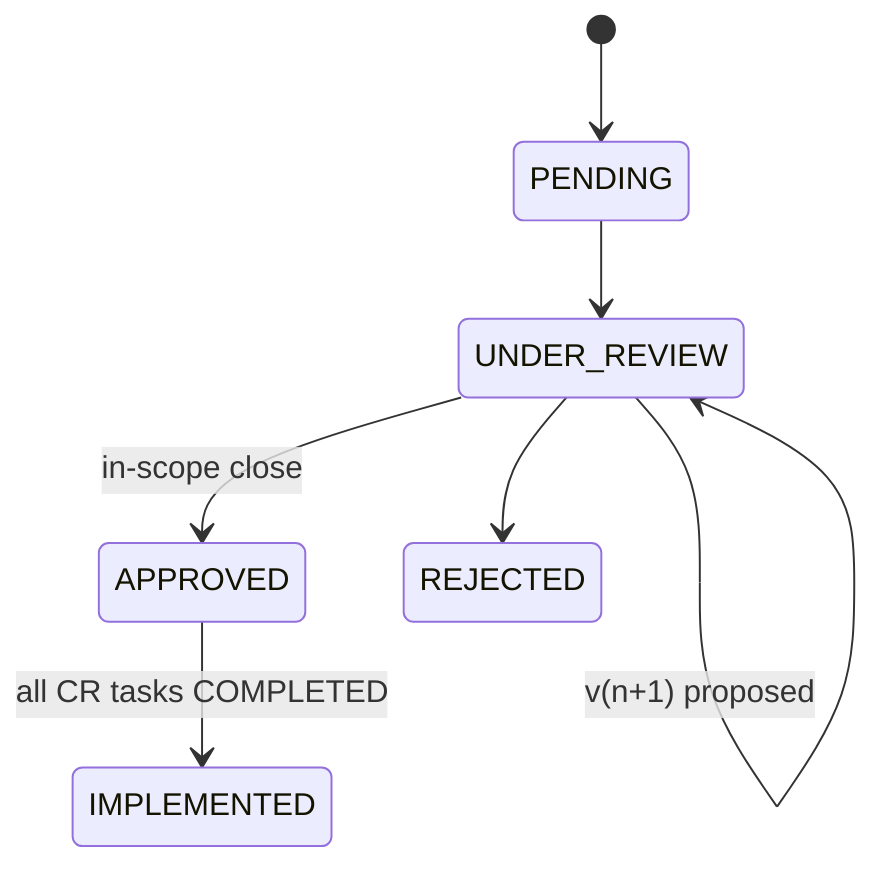

# 10 — SDA workflow (states & sequences)

## Requirement states
`DRAFT → NEEDS_CLARIFICATION → DRAFT → READY → APPROVED` (REJECTED terminal). Clarification creates a CLARIFICATION IR; its answer appends sourceContext and returns the requirement to DRAFT; AI-03 re-runs. Only humans approve (POST …/approve).

## Scope version states
`DRAFT → PENDING_APPROVAL → APPROVED | REJECTED | CHANGES_REQUESTED`, APPROVED → SUPERSEDED by the next approval. Only one open (DRAFT|PENDING_APPROVAL) version per scope. DRAFT editable; all else immutable.

## Approval sequence
PM `POST /approvals {scopeVersionId}` → version frozen + contentHash stored → client notified (app + email) → client approves/rejects/requests-changes (comment required for reject/changes; hash re-verified; caller must be the approval's portal user) → cascades (requirements APPROVED; previous version SUPERSEDED; linked CRs resolved) → all parties notified.

## Change request sequence
Client submits → base version pinned (409 if none) → AI-05 queued → PM reviews (UNDER_REVIEW) → approve with `createScopeVersion=false` (IN_SCOPE close) or `true` (v(n+1) DRAFT proposed → sent → client decides → APPROVED/SUPERSEDED/REJECTED propagation) → tasks (`onlyNew`) → all CR tasks COMPLETED → IMPLEMENTED. Reject requires a reason. Firewall: tasks need APPROVED version + APPROVED CR at write time.

